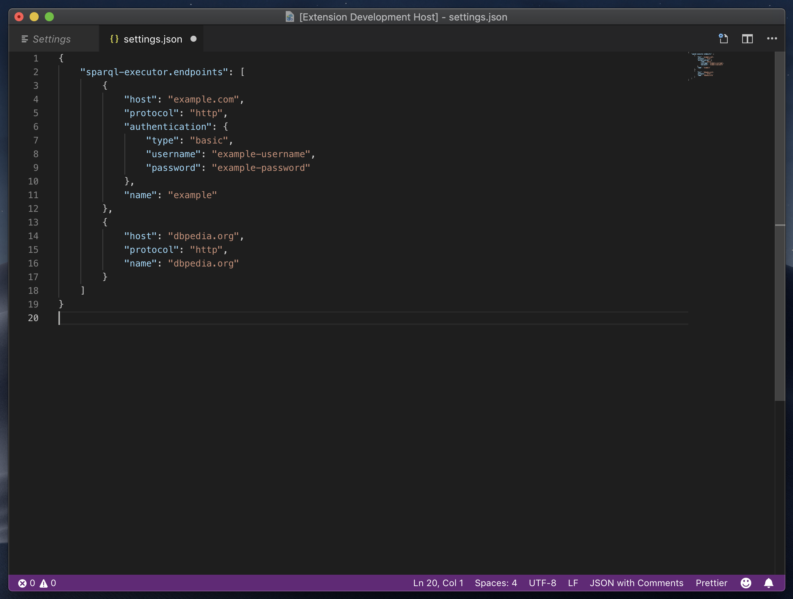
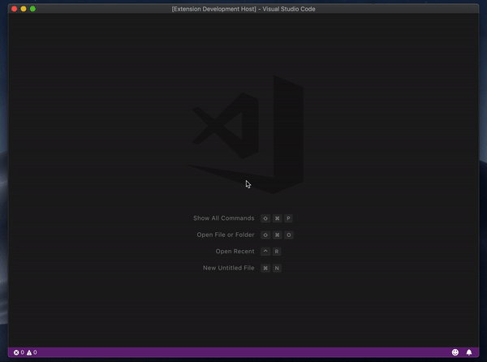

# SPARQL Executor README

The SPARQL Executor Visual Studio Code extension is a simple utility which allows you to configure SPARQL end-points and execute SPARQL queries.

## Features

### Configure Multiple SPARQL Endpoints

Open `settings.json` in Visual Studio Code and add SPARQL endpoints:

> Tip: Many popular extensions utilize animations. This is an excellent way to show off your extension! We recommend short, focused animations that are easy to follow.

### Select From SPARQL Endpoints

#### Select SPARQL Endpoint Using Command Palette

- `cmd` + `shift` + `P`
- Type the command `Select SPARQL Endpoint`
- Hit `enter`
- Search for and highlight your desired endpoint
- Hit `enter`

#### Select SPARQL Endpoint Using Key Command

The default key command for selecting a SPARQL endpoint is: `control` + `shift` + `E`.

### Execute SPARQL Queries

#### Execute SPARQL Query Using Command Palette

- `cmd` + `shift` + `P`
- Type the command `Execute SPARQL Query`
- Hit `enter`

#### Execute SPARQL Query Using Key Command

The default key command for executing a SPARQL query is: `control` + `shift` + `X`.

## Extension Settings

This extension contributes the following settings:

- `sparql-executor.endpoints`: configured list of SPARQL endpoints
- `sparql-executor.endpoints.protocol`: SPARQL endpoint protocol (`https` or `http`)
- `sparql-executor.endpoints.host`: SPARQL endpoint host, e.g. `example.com` (do not include the `/sparql` path)
- `sparql-executor.endpoints.authentication`: SPARQL endpoint authentication configuration
- `sparql-executor.endpoints.authentication.type`: SPARQL endpoint authentication type (currently only supports `basic`)
- `sparql-executor.endpoints.authentication.username`: SPARQL endpoint authentication username (for basic auth)
- `sparql-executor.endpoints.authentication.password`: SPARQL endpoint authentication password (for basic auth)

### 1.0.0

Initial release of SPARQL Executor which can simply:

- Configure multiple SPARQL endpoints with:
  - Protocol
  - Host
  - Authentication (currently *only* basic auth)
- Execute SPARQL queries and updates